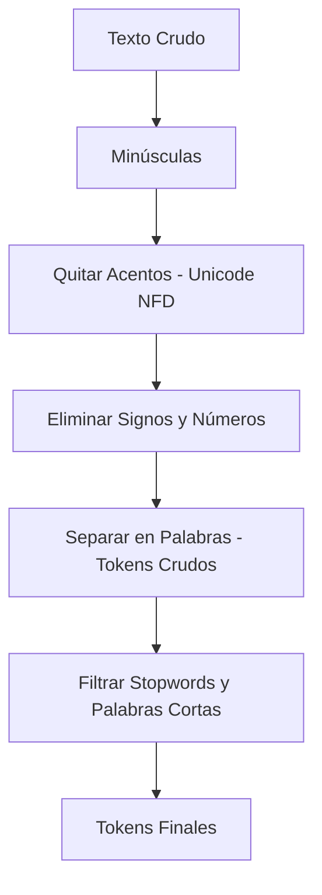

# Guía de Estudio 1: Preprocesamiento y Limpieza Lingüística

En esta guía revisaremos cómo nuestro sistema toma texto crudo y lo transforma en **tokens limpios y listos para ser modelados**. Toda esta lógica vive dentro del módulo **`text_processor.py`**.

---

## 1. ¿Por qué es vital limpiar el texto antes de procesarlo?
En Minería de Texto y Aprendizaje Automático existe una regla de oro: *"Garbage in, Garbage out"* (Si entra basura, sale basura). 

Si intentáramos calcular coocurrencias sobre texto crudo, palabras como *"el"*, *"la"*, *"que"* o los signos de puntuación serían los elementos más relacionados con todas las palabras, distorsionando por completo la semántica. Además, palabras como *"Árbol"* (con mayúscula y acento) y *"arbol"* (minúscula y sin acento) se contarían por separado, lo cual es ineficiente.

---

## 2. El Pipeline de Limpieza en `text_processor.py`

Cuando el sistema recibe el texto, lo pasa a través de la función **`normalizar_texto(texto)`**, la cual ejecuta los siguientes pasos ordenadamente:



### Paso A: Conversión a Minúsculas
El texto se pasa completamente a minúsculas (`texto = texto.lower()`). Esto garantiza que *"Inteligencia"* e *"inteligencia"* sean tratadas de forma idéntica.

### Paso B: Eliminación de Acentos (Normalización Unicode)
Para quitar los acentos sin romper letras como la "ñ", usamos la función **`quitar_acentos(texto)`**:
```python
def quitar_acentos(texto):
    nfkd = unicodedata.normalize("NFD", texto)
    return nfkd.encode("ascii", "ignore").decode("utf-8")
```
* **Explicación sencilla:** El estándar Unicode descompone los caracteres acentuados en dos partes: su letra base y su modificador de acento (ej. `á` se descompone en `a` + `´`). La normalización `"NFD"` hace esta separación, luego codificamos a ASCII ignorando los modificadores de acento (que no existen en ASCII) y volvemos a decodificar. El resultado es que *"tecnología"* se transforma en *"tecnologia"* de forma limpia.

### Paso C: Remoción de Caracteres Especiales y Números
Usamos expresiones regulares para borrar todo lo que no sea una letra estándar de la "a" a la "z" o un espacio en blanco:
```python
texto = re.sub(r"[^a-z\s]", " ", texto)
```
Esto borra números, comas, puntos, signos de interrogación, guiones, etc., y los reemplaza por un espacio.

### Paso D: Filtrado de Stopwords y Longitud
* **Stopwords (Palabras vacías):** Son conectores o artículos (como *"y"*, *"con"*, *"desde"*, *"el"*) que ocurren muchísimo pero no aportan carga semántica. Se cargan desde **`stopwords-es.txt`** usando la función `cargar_stopwords()`, la cual las normaliza para evitar problemas de acentos.
* **Palabras Cortas:** Se eliminan palabras de longitud menor o igual a 1 letra (como iniciales perdidas).
* **Filtro de Frecuencia Mínima:** Si el usuario configura una frecuencia mínima mayor a 1, aquellas palabras ultra-raras que aparezcan solo una vez en todo el texto se descartan para reducir ruido en las dimensiones finales.
