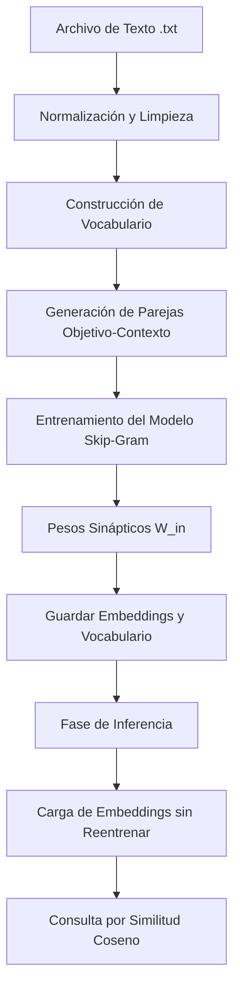

# Reporte Técnico: Sistema de Minería de Texto y Embeddings Neuronal (Skip-Gram)

**Materia:** Minería de Texto  
**Proyecto:** Generación de Embeddings Semánticos mediante Skip-Gram (Word2Vec) con NumPy desde cero  

---

## 1. Introducción
El presente reporte describe el diseño, la arquitectura y el funcionamiento del **Sistema de Minería de Texto y Embeddings**. Este sistema está diseñado para procesar un corpus textual en formato no estructurado (`.txt`), realizar una limpieza y normalización lingüística profunda, construir un vocabulario representativo y mapear cada palabra en un espacio vectorial continuo (embeddings) de baja dimensionalidad empleando el algoritmo **Skip-Gram (Word2Vec)** implementado desde cero en NumPy. Finalmente, el sistema permite realizar consultas semánticas en tiempo real empleando la métrica de similitud coseno.

---

## 2. Arquitectura del Sistema

El flujo de procesamiento del sistema se divide en dos fases principales: **Fase de Entrenamiento (Preprocesamiento y Aprendizaje Neuronal)** y **Fase de Inferencia/Consulta (Búsqueda Semántica)**.

### Fase A: Preprocesamiento y Normalización
1. **Conversión a minúsculas y eliminación de acentos:** Se normaliza el texto mediante el estándar Unicode (`NFD`) descomponiendo caracteres acentuados y eliminando sus modificadores (p. ej., `también` $\rightarrow$ `tambien`).
2. **Remoción de caracteres no alfabéticos:** Se descartan números, signos de puntuación y caracteres especiales utilizando expresiones regulares (`[^a-z\s]`).
3. **Filtrado de Stopwords:** Se eliminan palabras vacías o conectores gramaticales sin carga semántica (cargados dinámicamente desde el archivo `stopwords-es.txt`).
4. **Filtrado por Frecuencia Mínima:** Se descartan palabras con frecuencia menor a un umbral programable (`MIN_FRECUENCIA = 1`) para evitar ruido en el vocabulario.

### Fase B: Construcción de Vocabulario y Representación Espacial
1. **One-Hot Encoding Muestra:** Se genera una representación dispersa preliminar donde cada palabra es un vector del tamaño del vocabulario ($V$) con un único elemento activo ($1$).
2. **Generación de Parejas de Contexto:** A partir de la secuencia limpia de tokens, se extraen las parejas (palabra objetivo, palabra contexto) que ocurren dentro de una ventana de vecindad $C$.

### Fase C: Modelado Matemático de Relaciones Semánticas (Skip-Gram)
El algoritmo Skip-Gram es un modelo de red neuronal de dos capas de pesos (sin capa oculta no lineal) que aprende a predecir las palabras del contexto a partir de una palabra objetivo dada.

1. **Parámetros del Modelo (Pesos Sinápticos):**
   * **Matriz de Entrada ($W_{\text{in}}$):** De dimensiones $V \times d$, donde $V$ es el tamaño del vocabulario y $d$ es la dimensión de los embeddings (`DIMENSIONES = 50`). La fila $i$ corresponde al vector denso de la palabra objetivo $i$.
   * **Matriz de Salida ($W_{\text{out}}$):** De dimensiones $d \times V$, donde la columna $j$ representa el vector de contexto para la palabra $j$.

2. **Propagación Hacia Adelante (Forward Pass):**
   Dada una palabra objetivo con índice de vocabulario $i$:
   * La representación oculta $h$ se obtiene extrayendo directamente la fila correspondiente de $W_{\text{in}}$:
     $$h = W_{\text{in}}[i, :] \quad (\text{vector de tamaño } d)$$
   * Se calculan los valores de activación o puntuaciones sin normalizar (logits) $z$ multiplicando por la matriz de salida:
     $$z = h \cdot W_{\text{out}} \quad (\text{vector de tamaño } V)$$
   * Se aplica la función de activación **Softmax** para convertir los logits en una distribución de probabilidad $\hat{y}$ sobre todo el vocabulario:
     $$\hat{y}_k = \text{softmax}(z)_k = \frac{e^{z_k - \max(z)}}{\sum_{m=1}^V e^{z_m - \max(z)}} \quad (\text{donde } \max(z) \text{ previene desbordamiento numérico})$$

3. **Cálculo de Pérdida (Cross-Entropy Loss):**
   Para una pareja real de entrenamiento donde la palabra de contexto correcta tiene el índice $j$ en el vocabulario:
   $$L = -\log P(w_c | w_t) = -\log \hat{y}_j$$

4. **Retropropagación y Actualización de Parámetros (Stochastic Gradient Descent - SGD):**
   * **Gradiente del error de salida ($e$):**
     $$e = \hat{y} - y \quad (\text{vector de tamaño } V)$$
     Donde $y$ es el vector objetivo *one-hot* de la palabra contexto (es decir, $e_k = \hat{y}_k$ para todo $k \neq j$, y $e_j = \hat{y}_j - 1$).
   * **Gradiente respecto a la matriz de pesos de salida ($W_{\text{out}}$):**
     $$\frac{\partial L}{\partial W_{\text{out}}} = h^T \cdot e \implies dW_{\text{out}} = \text{outer}(h, e) \quad (\text{matriz de tamaño } d \times V)$$
   * **Gradiente respecto a la representación oculta ($h$ / fila de $W_{\text{in}}$):**
     $$\frac{\partial L}{\partial h} = W_{\text{out}} \cdot e \implies dh = W_{\text{out}} \cdot e \quad (\text{vector de tamaño } d)$$
   * **Actualización de pesos** con una tasa de aprendizaje $\eta$ (`LEARNING_RATE = 0.05`):
     $$W_{\text{out}} \leftarrow W_{\text{out}} - \eta \cdot dW_{\text{out}}$$
     $$W_{\text{in}}[i, :] \leftarrow W_{\text{in}}[i, :] - \eta \cdot dh$$

---

## 3. Estructura Modular del Proyecto
Para garantizar la mantenibilidad, escalabilidad y legibilidad del código, el sistema está desacoplado en módulos altamente especializados con responsabilidades únicas:

1. **`config.py` (Módulo de Configuración):** Centraliza la definición de los hiperparámetros globales (p. ej., tamaño de ventana, dimensiones del vector, tasa de aprendizaje, épocas, frecuencia mínima) y la definición de rutas persistentes en el disco.
2. **`utils.py` (Módulo de Utilerías Visuales):** Provee una capa homogénea para las impresiones en consola (títulos estéticos, avisos de error, confirmaciones exitosas e información estándar), aislando la lógica visual de los algoritmos matemáticos.
3. **`text_processor.py` (Procesamiento Lingüístico):** Encapsula todas las operaciones de limpieza del lenguaje. Carga e indexa el archivo de *stopwords*, remueve acentos mediante normalización Unicode y tokeniza/filtra la secuencia del corpus de texto.
4. **`embeddings_model.py` (Módulo de Modelado Matemático):** Contiene la lógica nuclear para construir el vocabulario, generar muestras One-Hot, calcular la matriz de coocurrencia (por retrocompatibilidad), implementar la función Softmax, ejecutar el bucle de optimización neuronal Skip-Gram mediante SGD, guardar resultados en disco y buscar términos utilizando similitud coseno.
5. **`mineria_tex_final.py` (Orquestador Principal):** Actúa como el punto de entrada ejecutable de la aplicación. Gestiona el bucle de interacción CLI (interfaz de línea de comandos) con el usuario, llamando ordenadamente a los diferentes módulos para ejecutar el flujo seleccionado.

---

## 4. Análisis de Cumplimiento de Requerimientos Críticos

| Criterio de la Rúbrica | Estado en el Código | Explicación Técnica e Implementación |
| :--- | :---: | :--- |
| **Entrenamiento Previo Terminado** | **SÍ CUMPLE** | Los resultados se guardan en archivos persistentes en la carpeta `/resultados_modelo`. En la presentación se utiliza la **Opción 2**, que carga directamente los archivos sin repetir el pipeline de entrenamiento. |
| **Carga de Embeddings, Vocabulario, Tokens y Parejas** | **SÍ CUMPLE** | El sistema cuenta con funciones dedicadas a exportar e importar de manera estructurada los embeddings (`.npy`), vocabulario, tokens y parejas de contexto en formato `.csv` para su análisis fuera del script si es necesario. |
| **Resultados Coinciden con el Contexto** | **SÍ CUMPLE** | La similitud se evalúa sobre la matriz $W_{\text{in}}$ optimizada. Al entrenar sobre parejas de contexto real local, el modelo neuronal agrupa palabras con contextos compartidos en regiones contiguas del espacio vectorial continuo. |
| **El Contexto Cambia según la Ventana** | **SÍ CUMPLE** | El tamaño de la ventana de contexto `VENTANA` es una variable dinámica configurable en la Opción 1. Cambiar este valor altera directamente las parejas objetivo-contexto que alimentan la optimización neuronal, modificando los embeddings resultantes. |
| **Tratamiento de Diferencias en Límites (Palabras Iniciales y Finales)** | **SÍ CUMPLE** | Durante el barrido del texto, el código previene desbordamientos de límites al inicio ($i < \text{VENTANA}$) y al final ($i > \text{largo} - \text{VENTANA}$) acotando la ventana dinámicamente mediante:  `inicio = max(0, i - VENTANA)` y `fin = min(len(tokens), i + VENTANA + 1)`. |

---

## 5. Módulo de Búsqueda Semántica
La correspondencia semántica se evalúa mediante la métrica de **Similitud Coseno** entre el vector de la palabra de consulta $u$ y los vectores $v$ de todas las demás palabras en el vocabulario:

$$\text{Similitud Coseno}(u, v) = \frac{u \cdot v}{\|u\| \|v\|} = \frac{\sum_{i=1}^{d} u_i v_i}{\sqrt{\sum_{i=1}^{d} u_i^2} \sqrt{\sum_{i=1}^{d} v_i^2}}$$

Este cálculo devuelve un valor en el rango $[-1, 1]$, donde un valor cercano a $1.0$ representa una alta coincidencia conceptual en el corpus de texto entrenado.
