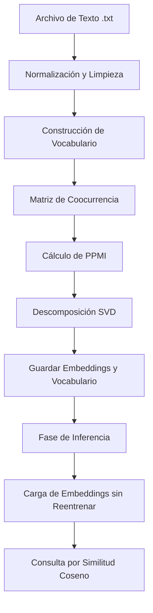

# Reporte Técnico: Sistema de Minería de Texto y Embeddings

**Materia:** Minería de Texto  
**Proyecto:** Generación de Embeddings Semánticos mediante PPMI y SVD  

---

## 1. Introducción
El presente reporte describe el diseño, la arquitectura y el funcionamiento del **Sistema de Minería de Texto y Embeddings**. Este sistema está diseñado para procesar un corpus textual en formato no estructurado (`.txt`), realizar una limpieza y normalización lingüística profunda, construir un vocabulario representativo y mapear cada palabra en un espacio vectorial continuo (embeddings) de baja dimensionalidad. Finalmente, el sistema permite realizar consultas semánticas en tiempo real empleando la métrica de similitud coseno.

---

## 2. Arquitectura del Sistema

El flujo de procesamiento del sistema se divide en dos fases principales: **Fase de Entrenamiento (Preprocesamiento y Modelado)** y **Fase de Inferencia/Consulta (Búsqueda Semántica)**.

### Fase A: Preprocesamiento y Normalización
1. **Conversión a minúsculas y eliminación de acentos:** Se normaliza el texto mediante el estándar Unicode (`NFD`) descomponiendo caracteres acentuados y eliminando sus modificadores (p. ej., `también` $\rightarrow$ `tambien`).
2. **Remoción de caracteres no alfabéticos:** Se descartan números, signos de puntuación y caracteres especiales utilizando expresiones regulares (`[^a-z\s]`).
3. **Filtrado de Stopwords:** Se eliminan palabras vacías o conectores gramaticales sin carga semántica (cargados dinámicamente desde el archivo `stopwords-es.txt`).
4. **Filtrado por Frecuencia Mínima:** Se descartan palabras con frecuencia menor a un umbral programable (`MIN_FRECUENCIA = 1`) para evitar ruido en el vocabulario.

### Fase B: Construcción de Vocabulario y Representación Espacial
1. **One-Hot Encoding Muestra:** Se genera una representación dispersa preliminar donde cada palabra es un vector del tamaño del vocabulario ($V$) con un único elemento activo ($1$).
2. **Generación de Parejas de Contexto:** A partir de la secuencia limpia de tokens, se extraen las parejas (palabra objetivo, palabra contexto) que ocurren dentro de una ventana de vecindad $C$.

### Fase C: Modelado Matemático de Relaciones Semánticas
1. **Matriz de Coocurrencia ($M$):** Se construye una matriz de dimensiones $V \times V$, donde cada celda $M_{i,j}$ almacena el conteo acumulado de veces que la palabra $j$ aparece en la ventana de contexto de la palabra $i$.
2. **Positive Pointwise Mutual Information (PPMI):** Para evitar el sesgo causado por palabras altamente frecuentes, se calcula la información mutua puntual:
   $$\text{PMI}(w, c) = \log_2 \left( \frac{P(w, c)}{P(w)P(c)} \right) = \log_2 \left( \frac{M_{i,j} \cdot N}{\sum_k M_{i,k} \cdot \sum_k M_{k,j}} \right)$$
   Los valores negativos de PMI (asociaciones menores que el azar) se sustituyen por $0$ para obtener la matriz $\text{PPMI}$:
   $$\text{PPMI}(w, c) = \max(0, \text{PMI}(w, c))$$
3. **Reducción de Dimensionalidad mediante SVD:** Se descompone la matriz PPMI usando la Descomposición en Valores Singulares:
   $$\text{PPMI} \approx U \cdot \Sigma \cdot V^T$$
   Se conservan únicamente las primeras $k$ dimensiones más significativas (`DIMENSIONES = 50`), multiplicando la matriz izquierda singular truncada por los valores singulares para obtener la matriz densa de embeddings:
   $$\text{Embeddings} = U_{:, :k} \cdot \Sigma_{:k, :k}$$

---

## 3. Estructura Modular del Proyecto
Para garantizar la mantenibilidad, escalabilidad y legibilidad del código, el sistema ha sido refactorizado y desacoplado en módulos altamente especializados con responsabilidades únicas:

1. **`config.py` (Módulo de Configuración):** Centraliza la definición de los hiperparámetros globales (p. ej., tamaño de ventana, dimensiones del SVD, frecuencia mínima) y la definición de rutas persistentes en el disco.
2. **`utils.py` (Módulo de Utilerías Visuales):** Provee una capa homogénea para las impresiones en consola (títulos estéticos, avisos de error, confirmaciones exitosas e información estándar), aislando la lógica visual de los algoritmos matemáticos.
3. **`text_processor.py` (Procesamiento Lingüístico):** Encapsula todas las operaciones de limpieza del lenguaje. Carga e indexa el archivo de *stopwords*, remueve acentos mediante normalización Unicode y tokeniza/filtra la secuencia del corpus de texto.
4. **`embeddings_model.py` (Módulo de Modelado Matemático):** Contiene la lógica nuclear para construir el vocabulario, generar muestras One-Hot, calcular la matriz de coocurrencia (con soporte dinámico de fronteras), calcular matrices PPMI, aplicar la descomposición matemática SVD, así como serializar en disco y buscar términos utilizando similitud coseno.
5. **`mineria_tex_final.py` (Orquestador Principal):** Actúa como el punto de entrada ejecutable de la aplicación. Gestiona el bucle de interacción CLI (interfaz de línea de comandos) con el usuario, llamando ordenadamente a los diferentes módulos para ejecutar el flujo seleccionado.

---

## 5. Análisis de Cumplimiento de Requerimientos Críticos

| Criterio de la Rúbrica | Estado en el Código | Explicación Técnica e Implementación |
| :--- | :---: | :--- |
| **Entrenamiento Previo Terminado** | **SÍ CUMPLE** | Los resultados se guardan en archivos persistentes en la carpeta `/resultados_modelo`. En la presentación se utiliza la **Opción 2**, que carga directamente los archivos sin repetir el pipeline de entrenamiento. |
| **Carga de Embeddings, Vocabulario, Tokens y Parejas** | **SÍ CUMPLE** | El sistema cuenta con funciones dedicadas a exportar e importar de manera estructurada los embeddings (`.npy`), vocabulario, tokens y parejas de contexto en formato `.csv` para su análisis fuera del script si es necesario. |
| **Resultados Coinciden con el Contexto** | **SÍ CUMPLE** | La similitud se evalúa sobre la matriz PPMI comprimida por SVD. Al basarse en la coocurrencia local, las palabras similares recuperadas corresponden estrictamente al contexto en el que coocurrieron en el texto fuente. |
| **El Contexto Cambia según la Ventana** | **SÍ CUMPLE** | El tamaño de la ventana de contexto `VENTANA` es una variable dinámica configurable en la Opción 1. Cambiar este valor altera directamente el cálculo de coocurrencia, modificando los embeddings resultantes. |
| **Tratamiento de Diferencias en Límites (Palabras Iniciales y Finales)** | **SÍ CUMPLE** | Durante el barrido del texto, el código previene desbordamientos de límites al inicio ($i < \text{VENTANA}$) y al final ($i > \text{largo} - \text{VENTANA}$) acotando la ventana dinámicamente mediante:  `inicio = max(0, i - VENTANA)` y `fin = min(len(tokens), i + VENTANA + 1)`. |

---

## 6. Módulo de Búsqueda Semántica
La correspondencia semántica se evalúa mediante la métrica de **Similitud Coseno** entre el vector de la palabra de consulta $u$ y los vectores $v$ de todas las demás palabras en el vocabulario:

$$\text{Similitud Coseno}(u, v) = \frac{u \cdot v}{\|u\| \|v\|} = \frac{\sum_{i=1}^{d} u_i v_i}{\sqrt{\sum_{i=1}^{d} u_i^2} \sqrt{\sum_{i=1}^{d} v_i^2}}$$

Este cálculo devuelve un valor en el rango $[-1, 1]$, donde un valor cercano a $1.0$ representa una alta coincidencia conceptual en el corpus de texto proporcionado.
